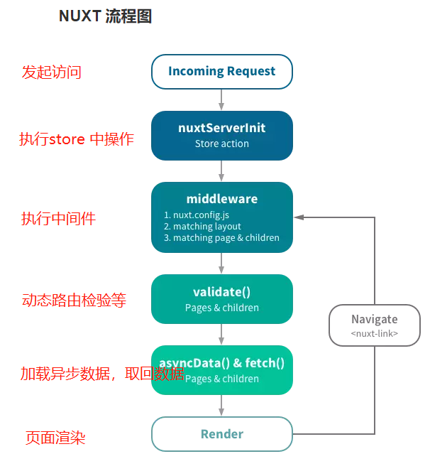
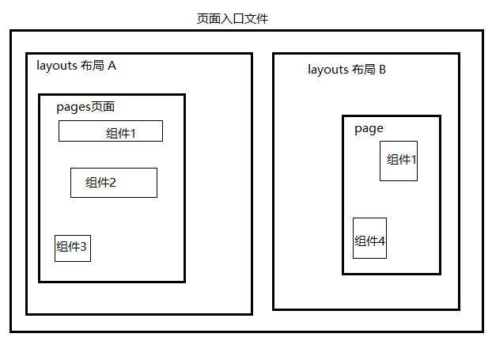

# mt-app







## Quick Start


> #### 创建nuxt工程

1.全局安装nuxt脚手架

```
npm i -g npx
```

2.创建目录

```
npx create-nuxt-app 项目名称
```


> 其他配置


1.如果使用css预处理器，如sass，就需要安装sass的相关插件

```
npm i sass-loader node-sass --save-dev
```


2.使用es6的import/export

使用依赖     `"babel-preset-es2015": "^6.24.1”`

```
npm i babel-cli // 这是babel解释器的客户端主程序  
npm i babel-core // babel的核心文件,好像默认会自动安装 
npm i babel-preset-es2015 // 把代码转换成ES6 
npm i babel-preset-stage-0// 把代码转换成ES7

npm install babel-preset-es2015
```


创建.babelrc文件

```
{
  "presets": ["es2015"]
}

```


> nuxt 配置文件

```
module.exports = {
  mode: 'universal',
  /*
  ** Headers of the page
  */
  head: {
    title: process.env.npm_package_name || '',
    meta: [
      {charset: 'utf-8'},
      {name: 'viewport', content: 'width=device-width, initial-scale=1'},
      {hid: 'description', name: 'description', content: process.env.npm_package_description || ''}
    ],
    link: [
      {rel: 'icon', type: 'image/x-icon', href: '/favicon.ico'}
    ]
  },
  rules: [
    {test: /\.vue$/,loader: "vue-loader"},
    {test: /\.css$/,use: ["vue-style-loader", "css-loader"]  }
  ],
  /*
  ** Customize the progress-bar color
  */
  loading: {color: '#fff'},
  /*
  ** Global CSS
  */
  css: [
    //element-ui配置
    'element-ui/lib/theme-chalk/reset.css',
    'element-ui/lib/theme-chalk/index.css',
    //css静态文件入口
    '@/assets/css/main.css'
  ],
  /*
  ** Plugins to load before mounting the App
  */
  plugins: [
    '@/plugins/element-ui'
  ],
  /*
  ** Nuxt.js dev-modules
  */
  devModules: [],
  /*
   ** axios
   */
  axios: {
    //axios
  },
  /*
  ** Nuxt.js modules
  */
  modules: [
   '@nuxtjs/axios'
  ],
  /*
  ** Build configuration
  */
  build: {
    transpile: [/^element-ui/],
    /*
    ** You can extend webpack config here
    */
    extend(config, ctx) {
    }
  },
  开启缓存
  cache: true
}

```


> package.json

```
 "scripts": {
    "dev": "cross-env NODE_ENV=development nodemon server/index.js --watch server --exec babel-node",
    "build": "nuxt build",
    "start": "cross-env NODE_ENV=production node server/index.js --exec babel-node",
    "generate": "nuxt generate"
  },
```


## 版本

### Dev. 1.0

基本应用构建 完成topbar的部分内容


### Dev 1.1 

完成导航栏搜索框的大部分细节


### Dev 1.11

完成搜索框细节包括其他组件样式，目前menu组件下的computer方法的无法定位到已经定义的属性，提示说未定义？


### Dev 1.12

解决1.11遗留的bug问题，完成菜单栏功能样式，目前位置布局有问题待调整


### Dev 1.13

调整导航栏布局,删除搜索交互,增加轮播卡和卡片


### Dev 1.14

实现搜索数据接口,展示栏数据接口,引入hover.css,调整tagbar布局